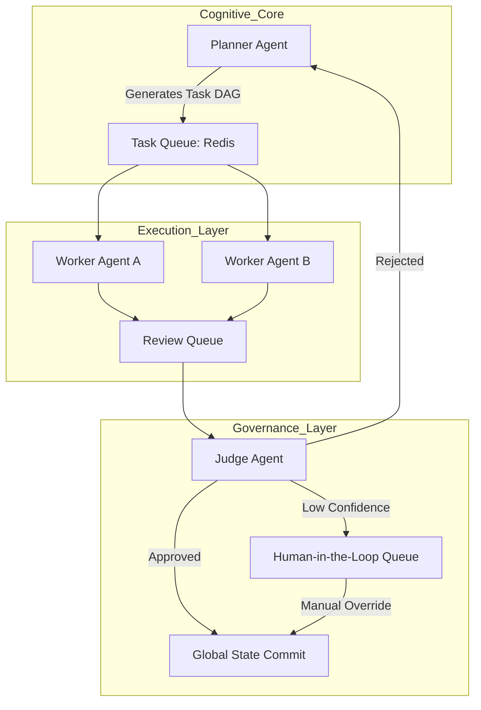

Architecture Strategy: Project Chimera (2026 Edition)

Last modified: 2026-02-05 · Author: (unspecified)

TL;DR
Project Chimera moves from static automation to Autonomous Influencer Agents: a scalable, fractal orchestration of thousands of lightweight agents managed by a single Super-Orchestrator. Recommended approach: FastRender Swarm (planner → workers → judge) with MCP for I/O, a hybrid persistence stack, and a probability-based HITL pipeline to balance speed and safety.

Purpose & Audience
- Purpose: Provide engineering and product teams with an actionable architecture and decision record to implement Chimera's autonomous agent platform.
- Audience: Architects, engineering leads, product owners, security and compliance reviewers.

Key Outcomes (up-front)
- Deployable micro-agent fleet that meets latency and cost targets (see Metrics).
- Clear decision log (ADRs) for major trade-offs.
- Operational governance: safety, finance controls, and auditability.

Decision Log (high level)
- [ADR-001 — Event bus: Kafka](../docs/adrs/ADR-001-event-bus-kafka.md) (owner: TBD, 2026-02-05)
- [ADR-002 — Semantic memory: Weaviate](../docs/adrs/ADR-002-semantic-memory-weaviate.md) (owner: TBD, 2026-02-05)

ADR Template
```markdown
ADR-### — Title
Context: One-paragraph background and constraints.
Decision: Chosen option and short rationale.
Alternatives: Brief alternatives considered.
Consequences: Operational, cost, and security impacts.
Owner: Name
Date: YYYY-MM-DD
```

1. Executive Summary — Takeaway: adopt a Fractal Orchestration with FastRender Swarm
Project Chimera transitions from static automation to Autonomous Influencer Agents—persistent, goal-directed entities with economic agency. The Fractal Orchestration pattern enables hierarchical control (Super-Orchestrator → planners → thousands of workers) to scale while keeping human oversight limited to exceptions.

2. Agent Pattern: FastRender Swarm — Takeaway: favor stateless workers + planners + judges
Role Definitions
- Planner (Strategist): decomposes campaign goals into a DAG of tasks, monitors MCP resources, and triggers re-planning on external shifts. Owner: (assign)
- Worker (Executor): stateless, ephemeral nodes executing atomic tasks (Draft Caption, Generate Image) via MCP Tools.
- Judge (Gatekeeper): QA comparator enforcing persona constraints and policies (SOUL.md). Uses OCC for safe global state commits.

Swarm Workflow (Mermaid)


3. Human-in-the-Loop (HITL) Strategy — Takeaway: route uncertain or sensitive items to humans
- Confidence scoring: every action has `confidence_score` ∈ [0.0,1.0].
- Routing rules:
  - High (>0.90): auto-approve and execute.
  - Medium (0.70–0.90): async hold for human review via Orchestrator Dashboard.
  - Low (<0.70): auto-reject and trigger re-plan.
- Mandatory escalation: any Sensitive Topic (Politics, Health, Finance) → HITL regardless of confidence.

4. Database Strategy: Hybrid Persistence — Takeaway: use specialized stores for each workload
Chimera is a constellation of services; map storage to workload:
- Transactional: PostgreSQL — user data, campaign config, operational logs.
- Semantic Memory: Weaviate — vector store for RAG persona recall.
- Episodic Cache: Redis — high-speed short-term history and task queuing (Celery/BullMQ).
- Financial Ledger: On-chain (Base) — immutable financial records via Coinbase AgentKit.

5. External Connectivity: Model Context Protocol (MCP) — Takeaway: MCP mediates all I/O
- Perception (Resources): standardized resource URIs, e.g., `twitter://mentions`, `news://market/prices`.
- Action (Tools): tool contracts (e.g., `generate_image()`, `send_transaction()`) invoked through MCP to isolate third-party volatility.

6. Agentic Commerce & Governance — Takeaway: enforce finance and security guardrails
- Non-custodial wallets per agent; CFO Judge enforces spend limits (e.g., max daily spend $50 USDC).
- Keys managed by enterprise secrets manager, injected at runtime; rotate and audit keys regularly.

Metrics and Acceptance Criteria
- Latency: median task execution < 2s for non-LLM steps.
- Throughput (concurrent workers):
    - Dev: 50 workers
    - Staging: 500 workers
    - Prod: 5,000 workers
- Cost (infra target):
    - Dev: <$200/month
    - Staging: <$2,000/month
    - Prod: <$10,000/month
- Availability: 99.9% (monthly uptime target)
- Financial ledger: RPO = 0 (on-chain); reconciliation RTO < 1 hour
- Safety: false positive rate on Sensitive Topic classifier < 1%.

Roadmap & Next Steps
- Create ADRs for each major decision (move ADRs into `/docs/adrs/`).
- Implement a minimal PoC: Planner + 3 Workers + Judge + Redis queue.
- Build Orchestrator Dashboard prototype for Medium-confidence reviews.

Risks & Mitigations
- Model drift → continuous evaluation pipelines and rollback capability.
- Financial exposure → hard-limits enforced in CFO Judge and realtime alerts.

Appendix
- References: SOUL.md, MCP spec (.vscode/mcp.json), operational runbooks.
- Diagrams: include Mermaid blocks above; export PNGs for presentations as needed.

Change log
- 2026-02-05: Added TL;DR, ADR template, metrics, and reorganized sections.


